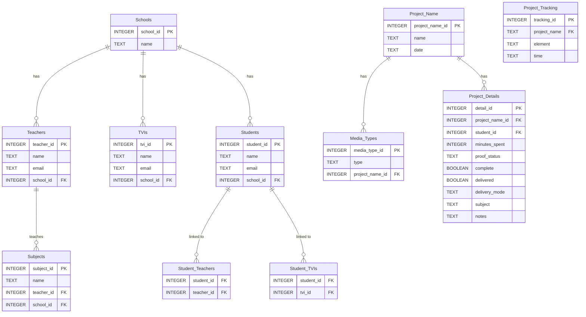

BrailleTranscriptionLedger/README.md
```

# BrailleTranscriptionLedger

## Project Overview

BrailleTranscriptionLedger is a Java-based application designed to streamline the process of tracking transcription work for accessible documents. The application provides a graphical user interface (GUI) for managing projects, tracking work elements, and generating detailed reports in PDF format. It leverages SQLite for data storage and supports dynamic configuration using JSON files.

---

## Features

### 1. **Project Setup**
   - Allows users to set up projects with details such as:
     - Academic subject
     - Associated school
     - Teachers and TVIs (multi-selection supported)
     - Media types
     - Notes and completion status

### 2. **Project Tracking**
   - Enables users to track specific elements of a project, including:
     - Work elements (e.g., Braille, Graphics, Formatting, Proofreading, Embossing)
     - Time spent (in HH:MM format)

### 3. **Dynamic Configuration**
   - Dropdown options for students, teachers, TVIs, subjects, and schools are dynamically loaded from JSON files.

### 4. **PDF Report Generation**
   - Generates detailed PDF reports based on project tracking data, including totals and subtotals for billing purposes.

---

## GUI Description

### **Tabs**
1. **Project Setup**
   - Input fields for project details.
   - Multi-selection lists for teachers and TVIs.
   - Dropdowns for academic subjects, schools, and media types.

2. **Project Tracking**
   - Dropdown for selecting a project by name.
   - Input fields for work elements and time spent.
   - Button to add tracking information.

### **Buttons**
- **Submit**: Saves project setup data to the database.
- **Add Tracking Info**: Saves tracking data to the database.
- **Generate PDF Report**: Creates a PDF ledger based on tracking data.

---

## SQL Schema

The application uses the following SQLite schema:



---

## JSON Configuration Files

### **students.json**
Contains a list of student initials.

### **teachers.json**
Contains a list of teacher names.

### **tvis.json**
Contains a list of TVI names.

### **subjects.json**
Contains a list of academic subjects.

### **schools.json**
Contains a list of school names.

---

## How to Run

1. Ensure Java is installed on your system.
2. Place the JSON configuration files (`students.json`, `teachers.json`, `tvis.json`, `subjects.json`, `schools.json`) in the root directory.

### Using Maven to Create and Run a Fat JAR

1. Install Maven on your system.
2. Navigate to the project directory and run the following command to create a fat JAR:
   ```bash
   mvn package
   ```
   This will generate a JAR file in the `target` directory.
3. Run the application using the following command:
   ```bash
   java -jar /path/to/file.jar
   ```
   Replace `/path/to/file.jar` with the actual path to the generated JAR file.

### Running Without Maven

1. Compile and run the application:
   ```bash
   javac LedgerGUI.java
   java LedgerGUI
   ```
2. Use the GUI to set up projects, track work, and generate reports.

---

## Future Enhancements

- Add support for importing/exporting data in CSV format.
- Enhance reporting capabilities with customizable templates.
- Integrate cloud-based storage for collaborative project management.

---

## License

This project is licensed under an Apache2.0 License.
