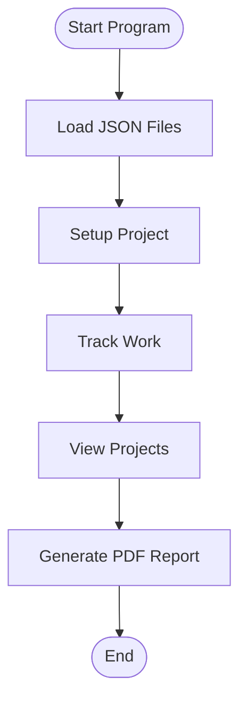
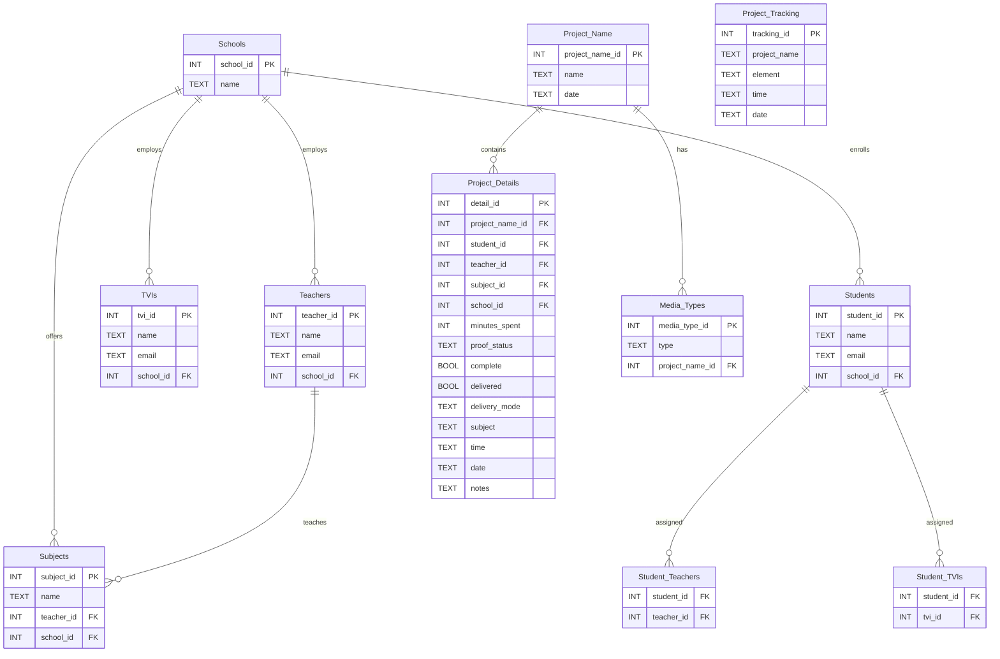

# Braille Transcription Ledger

## Accessibility Testing & Compliance

This application is developed with accessibility as a core requirement. We aim for compliance with WCAG 2.1 AA/AAA standards.

### Automated Accessibility Testing

- We recommend using the following tools to test accessibility:
  - [axe Accessibility Engine for Java](https://github.com/dequelabs/axe-core)
  - [Google Accessibility Developer Tools for Java](https://github.com/google/accessibility-developer-tools-java)
  - [JAWS Inspect](https://www.freedomscientific.com/products/software/jaws-inspect/)
  - [NVDA Screen Reader](https://www.nvaccess.org/)
  - [Lighthouse](https://developers.google.com/web/tools/lighthouse) (for web components)
  - [WAVE](https://wave.webaim.org/) (for web components)

### Manual Testing

- Test with keyboard only (Tab, Shift+Tab, Enter, Esc, arrow keys).
- Test with screen readers (JAWS, NVDA, VoiceOver).
- Test color contrast and zoom/magnification.
- Test with multiple languages.

### Compliance Goals

- All interactive elements are keyboard accessible.
- All feedback and errors are announced to screen readers.
- High-contrast and color-blind-friendly themes are available.
- All dialogs trap focus and support Esc/Close.
- Context-sensitive help and tooltips are provided.
- Localization and multi-language support is implemented.

### Build System Integration

You can integrate accessibility testing into your build process using Maven, Gradle, or Ant.  
Below are example configurations for each:

#### Maven

Add a plugin or execution to your `pom.xml` to run accessibility scans.  
Example using the [exec-maven-plugin](https://www.mojohaus.org/exec-maven-plugin/):

```xml
<plugin>
  <groupId>org.codehaus.mojo</groupId>
  <artifactId>exec-maven-plugin</artifactId>
  <version>3.1.0</version>
  <executions>
    <execution>
      <id>accessibility-scan</id>
      <phase>verify</phase>
      <goals>
        <goal>exec</goal>
      </goals>
      <configuration>
        <executable>java</executable>
        <arguments>
          <argument>-jar</argument>
          <argument>axe-core-java.jar</argument>
          <argument>--scan</argument>
          <argument>target/classes/yourapp.jar</argument>
        </arguments>
      </configuration>
    </execution>
  </executions>
</plugin>
```

#### Gradle

Add a custom task to your `build.gradle` to run accessibility scans:

```groovy
task accessibilityScan(type: Exec) {
    description = 'Run accessibility scan using axe-core-java'
    commandLine 'java', '-jar', 'axe-core-java.jar', '--scan', 'build/libs/yourapp.jar'
}

check.dependsOn accessibilityScan
```

#### Ant

Add a target to your `build.xml` for accessibility testing:

```xml
<target name="accessibility-scan">
    <exec executable="java">
        <arg value="-jar"/>
        <arg value="axe-core-java.jar"/>
        <arg value="--scan"/>
        <arg value="dist/yourapp.jar"/>
    </exec>
</target>
```

You can then run:
```
ant accessibility-scan
```

Refer to the documentation of your chosen accessibility tool for details on command-line usage and integration with your build system.


_Accessible Document Transcription Tracker for Teachers & TVIs_

---

## Table of Contents

1. [Overview](#overview)
2. [How the Program Works](#how-the-program-works)
3. [Compiling & Running the Program](#compiling--running-the-program)
    - [Using Gradle](#using-gradle)
    - [Using Maven](#using-maven)
    - [Using Ant](#using-ant)
4. [JSON Configuration Files](#json-configuration-files)
5. [Diagrams](#diagrams)
    - [Program Structure](#program-structure-diagram)
    - [Workflow](#workflow-diagram)
    - [Database Schema](#database-schema-diagram)
6. [How to Contribute](#how-to-contribute)
7. [License](#license)
8. [Contact](#contact)

---

## Overview

BrailleTranscriptionLedger is a desktop application designed to help teachers and TVIs (Teachers of the Visually Impaired) track, manage, and report on accessible document transcription projects. It features a simple graphical interface, persistent storage, and easy reporting.

- **No coding required to use!**
- **Runs on Windows, Mac, and Linux**
- **Tracks students, teachers, TVIs, subjects, schools, and project details**
- **Generates PDF reports for billing or record-keeping**

---

## How the Program Works

### Step-by-Step Guide

1. **Startup**
    - Double-click the application JAR file (or run from command line).
    - On first launch, the program creates its database and loads dropdown options from JSON files.

2. **Project Setup Tab**
    - Create a new transcription project.
    - Select or enter:
        - Academic subject
        - School
        - Teachers (multi-select)
        - TVIs (multi-select)
        - Media types (Braille, Large Print, Audio, etc.)
        - Notes and completion status

3. **Project Status Tab**
    - Track work done on existing projects.
    - Select a project, specify work element (Braille, Graphics, Formatting, etc.), enter time spent, add notes, and update status.

4. **Projects Tab**
    - View all tracked projects in a sortable table.
    - Filter and sort by student, teacher, subject, or completion status.

5. **PDF Report Generation**
    - Generate detailed PDF reports for billing or record-keeping.
    - Select date ranges and projects to include.

6. **Dynamic Dropdowns**
    - Students, teachers, TVIs, subjects, and schools are loaded from simple JSON files you can edit.

---

## Compiling & Running the Program

### Prerequisites

- **Java 17 or newer** (download from [Adoptium](https://adoptium.net/) or [Oracle](https://www.oracle.com/java/technologies/downloads/))
- **One build tool:** Gradle, Maven, or Ant (see below)
- **JSON configuration files** (see [JSON Configuration Files](#json-configuration-files))

### Using Gradle

1. Open a terminal/command prompt in the project folder.
2. Run:
    ```
    gradle build
    ```
    This creates a JAR file in `build/libs/`.

3. Run the program:
    ```
    java -jar build/libs/BrailleTranscriptionLedger.jar
    ```

### Using Maven

1. Open a terminal/command prompt in the project folder.
2. Run:
    ```
    mvn clean install
    ```
    This creates a JAR file in `target/`.

3. Run the program:
    ```
    java -jar target/BrailleTranscriptionLedger.jar
    ```

### Using Ant

> **Note:** If you do not see a `build.xml` file, you may need to create one. Here is a sample:

```xml
<project name="BrailleTranscriptionLedger" default="jar">
    <target name="compile">
        <mkdir dir="build"/>
        <javac srcdir="src/main/java" destdir="build"/>
    </target>
    <target name="jar" depends="compile">
        <jar destfile="BrailleTranscriptionLedger.jar" basedir="build">
            <manifest>
                <attribute name="Main-Class" value="LedgerGUI"/>
            </manifest>
        </jar>
    </target>
</project>
```

1. Save the above as `build.xml` in your project folder.
2. Run:
    ```
    ant jar
    ```
    This creates `BrailleTranscriptionLedger.jar` in your project folder.

3. Run the program:
    ```
    java -jar BrailleTranscriptionLedger.jar
    ```

---

## JSON Configuration Files

**Location:** Place all `.json` files in the project root folder (same place as the JAR file).

**Required Files:**
- `students.json`
- `teachers.json`
- `tvis.json`
- `subjects.json`
- `schools.json`
- (Optional: `media_type.json`, `delivery_mode.json`, etc.)

**Format Example:**

Each file should contain a JSON object with a key and an array of names. For example:

`students.json`
```json
{
  "students": ["Alice Smith", "Bob Jones", "Charlie Brown"]
}
```

`teachers.json`
```json
{
  "teachers": ["Ms. Johnson", "Mr. Lee", "Mrs. Patel"]
}
```

**Tip:** You can edit these files with Notepad, TextEdit, or any text editor. The program will reload them on startup.

---

## Diagrams

### Program Structure Diagram

```mermaid
graph TD
    A[LedgerGUI (Main Window)]
    B[Project Setup Tab]
    C[Project Status Tab]
    D[Projects Tab]
    E[PDF Report Generator]
    F[SQLite Database]
    G[JSON Config Loader]

    A --> B
    A --> C
    A --> D
    A --> E
    A --> G
    B --> F
    C --> F
    D --> F
    E --> F
    G --> B
    G --> C
    G --> D
```

### Workflow Diagram



### Database Schema Diagram



---

## How to Contribute

We welcome contributions from teachers, TVIs, and developers!

1. **Fork the repository** on GitHub.
2. **Create a new branch** for your changes.
3. **Make your changes** (code, documentation, or JSON files).
4. **Test your changes** to ensure they work.
5. **Open a pull request** with a clear description of what you changed and why.
6. For major changes, open an issue first to discuss your idea.

**Tips for Non-Technical Contributors:**
- You can contribute by improving the JSON files (adding students, teachers, etc.).
- Suggest new features or report bugs by opening an issue on GitHub.
- Help improve documentation for other teachers!

---

## License

This project is licensed under the [Apache License 2.0](https://www.apache.org/licenses/LICENSE-2.0).

---

## Contact

For questions, help, or suggestions:
- Open an issue on GitHub
- Or contact the project maintainer listed in the repository

---

_Thank you for helping make accessible education easier!_