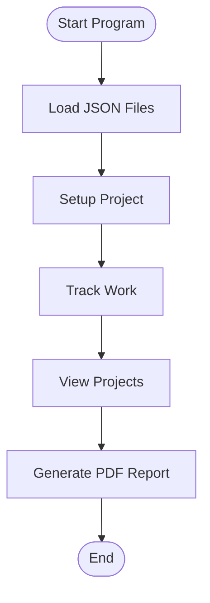
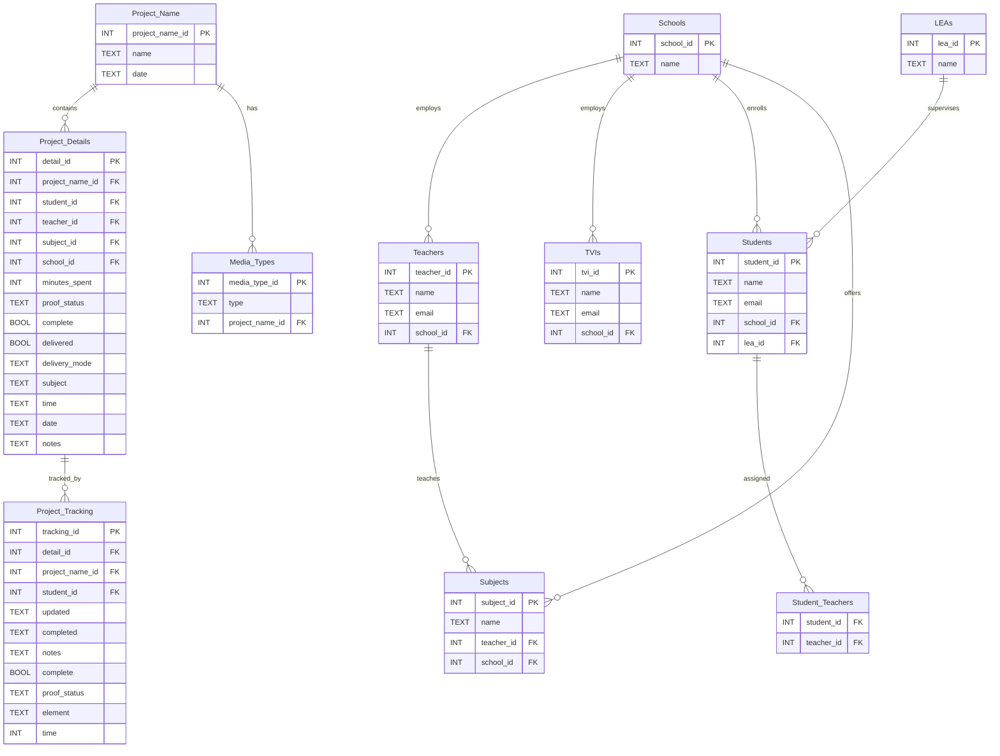

# Braille Transcription Ledger

_Accessible Document Transcription Tracker for Teachers & TVIs_

---

## Table of Contents

1. [Overview](#overview)
2. [How the Program Works](#how-the-program-works)
3. [Compiling & Running the Program](#compiling--running-the-program)
    - [Using Gradle](#using-gradle)
    - [Using Maven](#using-maven)
    - [Using Ant](#using-ant)
4. [JSON Configuration Files](#json-configuration-files)
5. [Accessibility & Compliance](#accessibility--compliance)
6. [Diagrams](#diagrams)
7. [How to Contribute](#how-to-contribute)
8. [License](#license)
9. [Contact](#contact)

---

## Overview

Braille Transcription Ledger is a desktop application designed to help teachers and TVIs (Teachers of the Visually Impaired) track, manage, and report on accessible document transcription projects. It features a simple graphical interface, persistent storage, and easy reporting.

- **No coding required to use!**
- **Runs on Windows, Mac, and Linux**
- **Tracks students, teachers, TVIs, subjects, schools, and project details**
- **Generates PDF reports for billing or record-keeping**
- **Accessible and easy to use**

---

## How the Program Works

### Step-by-Step Guide

1. **Startup**
    - Double-click the application JAR file (or run from command line).
    - On first launch, the program creates its database (using H2, no setup needed) and loads dropdown options from `.json.txt` files.

2. **Project Setup Tab**
    - Create a new transcription project.
    - Select or enter:
        - Academic subject
        - School
        - Teachers (multi-select)
        - TVIs (multi-select)
        - Media types (Braille, Large Print, Audio, etc.)
        - Notes and completion status

3. **Project Status Tab**
    - Track work done on existing projects.
    - Select a project, specify work element (Braille, Graphics, Formatting, etc.), enter time spent, add notes, and update status.

4. **Projects Tab**
    - View all tracked projects in a sortable table.
    - Filter and sort by student, teacher, subject, or completion status.

5. **PDF Report Generation**
    - Generate detailed PDF reports for billing or record-keeping.
    - Select date ranges and projects to include.

6. **Dynamic Dropdowns**
    - Students, teachers, TVIs, subjects, and schools are loaded from simple `.json.txt` files you can edit.

7. **Menus**
    - **File**: Exit and About.
    - **Accessibility**: Keyboard shortcuts, skip to main content, theme selection.
    - **Language**: Switch between English and Spanish.
    - **Help**: Keyboard shortcuts and help dialogs.

---

## Compiling & Running the Program

### Prerequisites

- **Java 17 or newer** (download from [Adoptium](https://adoptium.net/) or [Oracle](https://www.oracle.com/java/technologies/downloads/))
- **JSON configuration files** (see [JSON Configuration Files](#json-configuration-files))
- **One build tool:** Gradle, Maven, or Ant (see below)

### Using Gradle

1. Open a terminal or command prompt in the project folder.
2. Run:
    ```
    ./gradlew fatJar
    ```

    This will resolve dependencies, compile the code, and create a standalone "fat JAR" (with all dependencies included) at `build/libs/BrailleTranscriptionLedger-all.jar`.

3. To run the program:
    ```
    java -jar build/libs/BrailleTranscriptionLedger-all.jar
    ```

### Using Maven

1. Open a terminal or command prompt in the project folder.
2. Run:
    ```
    mvn clean install
    ```
    This will resolve dependencies, compile the code, and create a runnable JAR file in `target/BrailleTranscriptionLedger.jar`.

3. To run the program:
    ```
    java -jar target/BrailleTranscriptionLedger.jar
    ```

### Using Ant

1. Ensure you have `build.xml` in your project folder. The provided `build.xml` supports dependency management via Ivy, compiles sources, copies resources, and creates a runnable JAR in the `dist` directory.

2. **Download Apache Ivy 2.5.1:**  
   The Ant build requires `ivy-2.5.1.jar` to be present in the `lib` directory. This file is not included in the repository because `.gitignore` excludes uploading `.jar` files to GitHub.

   - Download Ivy 2.5.1 from the official Apache website:  
     [https://repo1.maven.org/maven2/org/apache/ivy/ivy/2.5.1/ivy-2.5.1.jar](https://repo1.maven.org/maven2/org/apache/ivy/ivy/2.5.1/ivy-2.5.1.jar)
   - Place the downloaded `ivy-2.5.1.jar` file in the `lib` folder at the root of your project.

3. Open a terminal or command prompt in the project folder.

4. Run:
    ```
    ant jar
    ```
    This will:
    - Download dependencies to `lib/`
    - Compile sources and copy resources to `build/`
    - Create the runnable JAR at `dist/BrailleTranscriptionLedger.jar`

5. To run the program:
    ```
    java -jar dist/BrailleTranscriptionLedger.jar
    ```

**Note:** All build systems ensure that resources (such as language `.properties` files) are included in the JAR, and dependencies are resolved automatically. If you encounter issues, ensure your Java version is 17 or newer and your build tool is up to date.

---

## JSON Configuration Files

**Location:** Change the names of the `.json.txt` files in /json_files to remove the .txt extension. They are named this way to protect sensitive information from being exposed accidentally online as the .gitignore file excludes uploading .json files.

**Required Files:**
- `students.json.txt`
- `teachers.json.txt`
- `tvis.json.txt`
- `LEAs.json.txt`
- `subjects.json.txt`
- `schools.json.txt`
- `media_type.json.txt`
- `delivery_mode.json.txt`
- `proof_status.json.txt`
- `project_type.json.txt`
- `project_element.json.txt`

**Format Example:**

Each file should contain a JSON object with a single property whose value is an array of entries. For example:

`students.json.txt`
```json
{
  "students": [
    "Student 1",
    "Student 2",
    "Student 3"
  ]
}
```

`teachers.json.txt`
```json
{
  "teachers": [
    "Teacher A",
    "Teacher B",
    "Teacher C"
  ]
}
```

`tvis.json.txt`
```json
{
  "tvis": [
    "Teacher A",
    "Teacher B",
    "Teacher C"
  ]
}
```

`subjects.json.txt`
```json
{
  "subjects": [
    "Math",
    "English",
    "Chemistry"
  ]
}
```

`schools.json.txt`
```json
{
  "schools": [
    "School 1",
    "School 2"
  ]
}
```

**Tip:** You can edit these files with Notepad, TextEdit, or any text editor. The program will reload them on startup. Make sure to keep the structure as a JSON object with a single array property matching the file's purpose.

---

## Accessibility & Compliance

This application is developed with accessibility as a core requirement. We aim for compliance with WCAG 2.1 AA/AAA standards and best practices for desktop applications.

**Key Accessibility Features:**
- All interactive elements are fully keyboard accessible (Tab, Shift+Tab, arrow keys, Space/Enter).
- Logical tab order and custom focus traversal ensure smooth navigation.
- Global keyboard shortcuts for help, form submission, PDF generation, and more (see below).
- All dialogs trap focus and support Esc/Close.
- Screen reader support: all fields, buttons, and tables have accessible names, labels, and descriptions.
- High-contrast and color-blind-friendly themes are available.
- All feedback, status messages, and errors are announced to screen readers.
- Context-sensitive help, tooltips, and a Help menu/dialog (Ctrl+.) listing all shortcuts and accessibility features.
- Multi-language support (English and Spanish) with accessible resource bundles.
- Visual focus indicators and support for system font scaling/high-DPI displays.

**Example Keyboard Shortcuts:**
- Open Help Menu: Ctrl + .
- Submit Form: Ctrl + Enter
- Generate PDF: Ctrl + G
- Move to Next/Previous Field: Tab / Shift+Tab
- Navigate Table/Dropdowns: Arrow Keys
- Activate Button/Checkbox: Spacebar/Enter
- Focus Menu Bar: Alt
- Close Dialog: Esc

**Testing & Recommendations:**
- Regularly tested with keyboard-only navigation and screen readers (NVDA, JAWS, VoiceOver).
- All themes meet or exceed WCAG 2.1 AA contrast requirements.
- Ongoing user feedback and accessibility testing are encouraged.

For a detailed accessibility analysis, feature summary, and recommendations, see [Accessibility.md](Accessibility.md).

---

## Diagrams

### Program Structure Diagram

```mermaid
graph TD
    A[LedgerGUI (Main Window)]
    B[Project Setup Tab]
    C[Project Status Tab]
    D[Projects Tab]
    E[PDF Report Generator]
    F[H2 Embedded Database]
    G[JSON Config Loader]

    A --> B
    A --> C
    A --> D
    A --> E
    A --> G
    B --> F
    C --> F
    D --> F
    E --> F
    G --> B
    G --> C
    G --> D
```

### Workflow Diagram



### Database Schema Diagram



---

## How to Contribute

We welcome contributions from teachers, TVIs, developers, and anyone interested in accessible education technology!

### Ways to Contribute

- **Code:** Add features, fix bugs, improve accessibility, or refactor for clarity and maintainability.
- **Documentation:** Improve this README, add usage guides, or clarify instructions for non-technical users.
- **Data:** Update or expand the `.json.txt` configuration files (students, teachers, etc.).
- **Testing:** Try the application on different platforms, test accessibility features, or help with automated testing.
- **Ideas & Feedback:** Suggest new features, report bugs, or propose workflow improvements.

### Contribution Process

1. **Fork the repository** on GitHub.
2. **Create a new branch** for your changes.
3. **Make your changes** (code, documentation, or JSON files).
4. **Test your changes** to ensure they work as expected.
5. **Open a pull request** with a clear description of what you changed and why.
6. For major changes, open an issue first to discuss your idea with the maintainers.

### Tips for Non-Technical Contributors

- You can contribute by:
  - Suggest new features or report bugs by opening an issue on GitHub.
  - Help improve documentation for other teachers and users.
  - Share feedback on accessibility, usability, or language support.

### Code Style & Best Practices

- Follow the existing code style and conventions.
- Write clear commit messages and pull request descriptions.
- Test your changes on all supported platforms if possible.
- Ensure accessibility features remain functional.

Thank you for helping make accessible education easier for everyone!

---

## License

This project is licensed under the [Apache License 2.0](https://www.apache.org/licenses/LICENSE-2.0).

---

## Contact

For questions, help, or suggestions:
- Open an issue on GitHub
- Or contact the project maintainer listed in the repository

---

_Thank you for helping make accessible education easier!_
